# Ray Tracer in Scala
Photorealistic 3D renderer implemented in Scala

Implemented by following the book [The Ray Tracer Challenge
 A Test-Driven Guide to Your First 3D Renderer](https://pragprog.com/book/jbtracer/the-ray-tracer-challenge) by Jamis Buck

## 2. Drawing on a Canvas
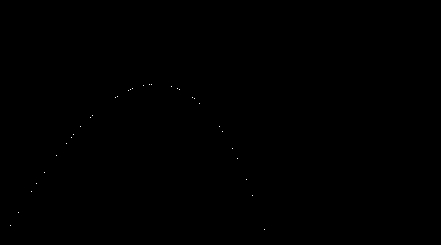

## 4. Matrix Transformations
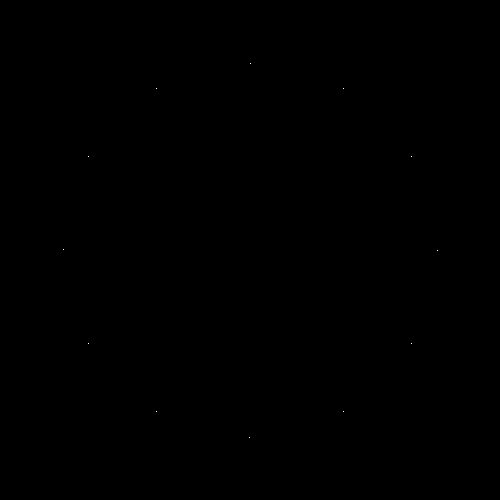

## 5. Ray-Sphere Intersections
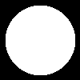

## 6. Light and Shading
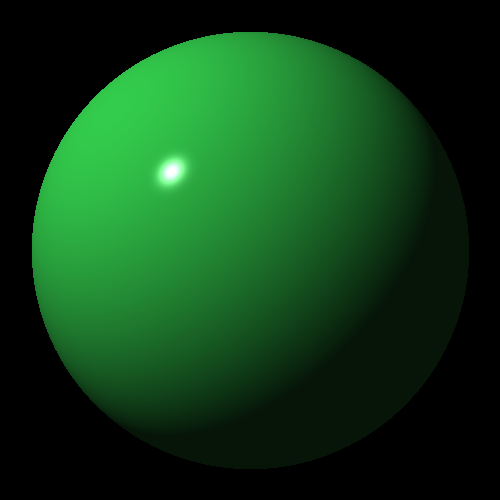

## 7. Making a Scene
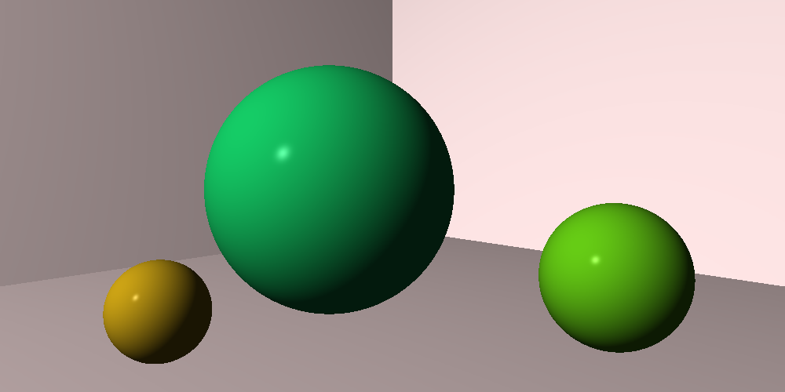

## 8. Shadows
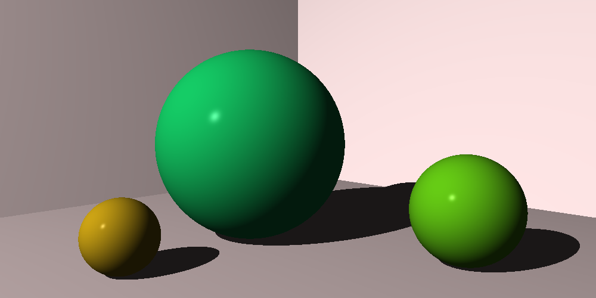

## 9. Planes
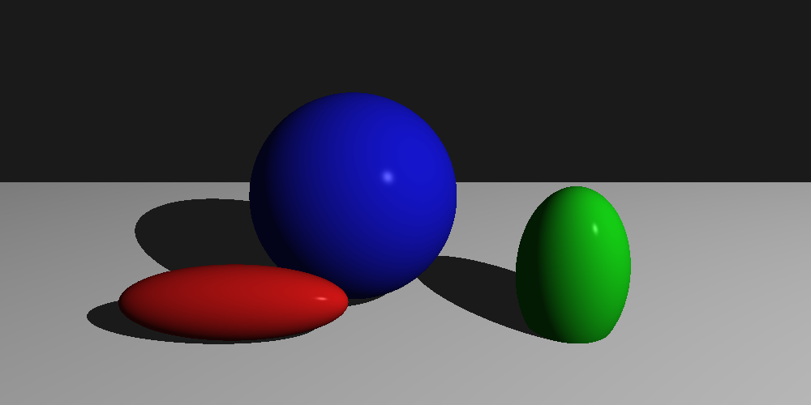

## 10. Patterns
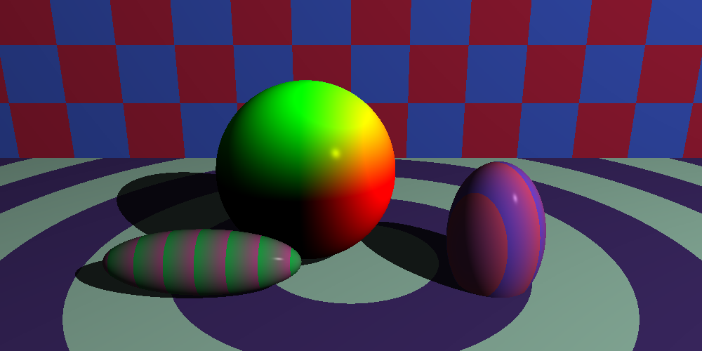

## 11. Reflection and Refraction
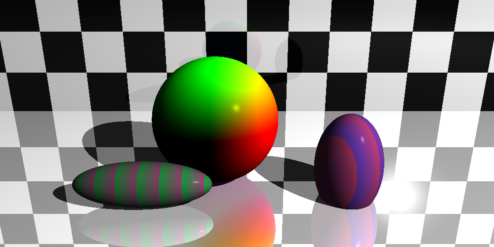

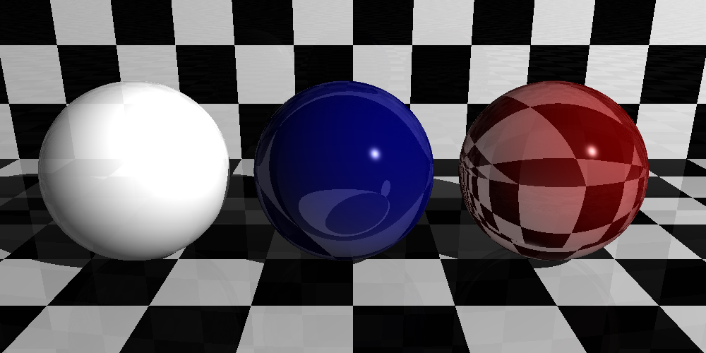

## 12. Cubes

## 13. Cylinders
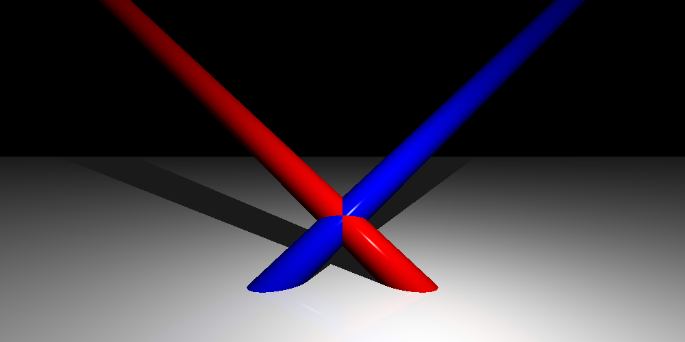

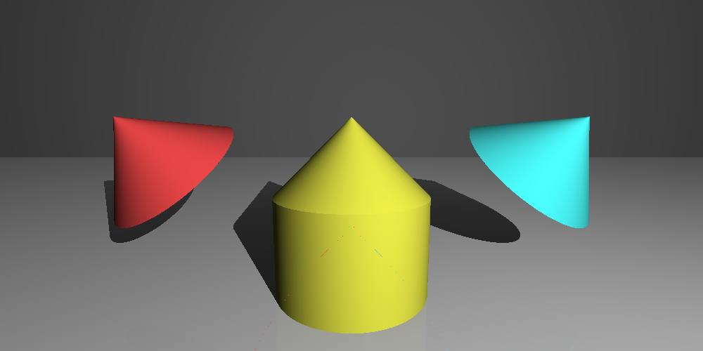

## 14. Groups
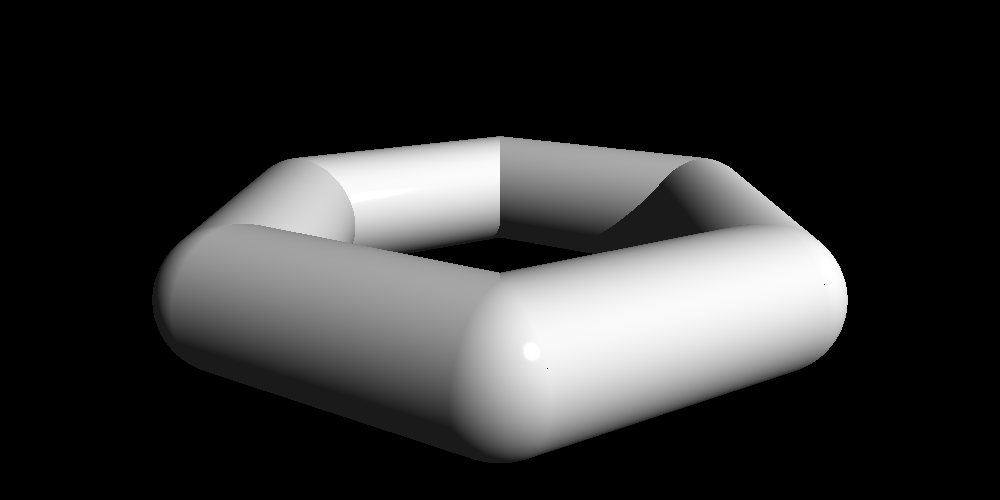

## 15. Triangles
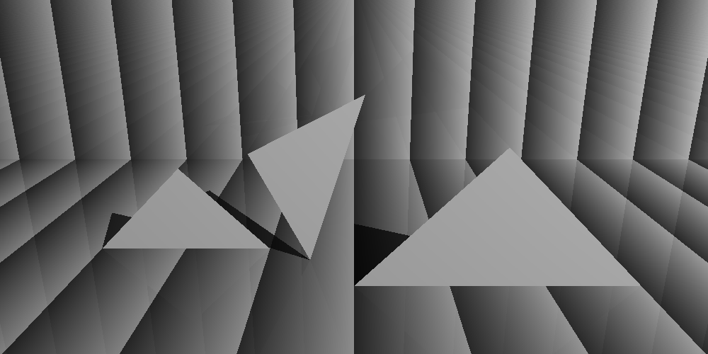