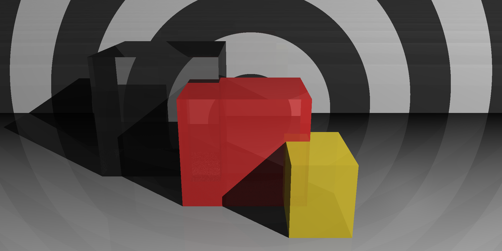

# Ray Tracer in Scala
Photorealistic 3D renderer implemented in Scala

Implemented by following the book [The Ray Tracer Challenge
 A Test-Driven Guide to Your First 3D Renderer](https://pragprog.com/book/jbtracer/the-ray-tracer-challenge) by Jamis Buck

## 2. Drawing on a Canvas

## 4. Matrix Transformations

## 5. Ray-Sphere Intersections

## 6. Light and Shading

## 7. Making a Scene

## 8. Shadows

## 9. Planes

## 10. Patterns

## 11. Reflection and Refraction

## 12. Cubes
